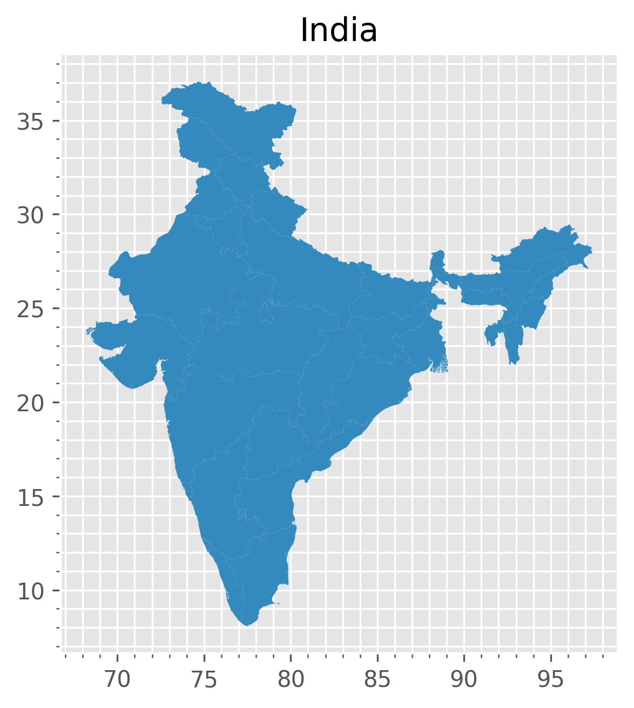
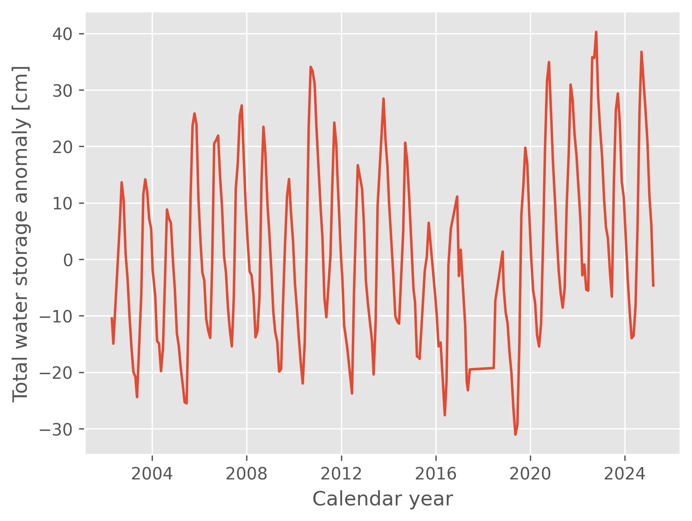

#Analysing the Total Water Storage Anomaly [TWSA} in cm from GRACE/FO - JPL product

## Author
- Mohammad Afzal Shadab (mashadab@utexas.edu)

## Corresponding author affiliations (Email provided)
Princeton University

Figures: Shapefile of India

Figures: Total water storage anomaly in [cm] from GRACE/GRACE-FO JPL Product for India between 2002-2025

### Quick Usage
After cloning the repository and installing the required libraries, run the jupyter notebook named 'ProcessingGRACE_2024_ArWt (1).ipynb'. 
